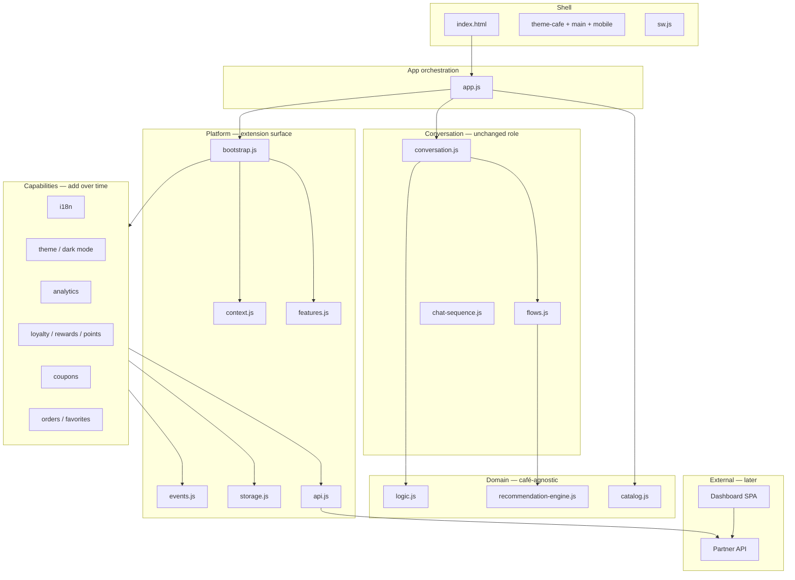

# VIBY scalable architecture

Goal: grow from a single-tenant chat menu into coupons, loyalty, i18n, analytics, and a multi-café fleet **without rewriting** the conversation engine, recommendation logic, or UI components. New behavior ships as **capabilities** behind **feature flags** and a stable **platform** API.

## Principles

| Principle | Meaning |
|-----------|---------|
| **Core stays stable** | `logic.js`, `recommendation-engine.js`, `flows.js`, `conversation.js`, and `components/*` keep their roles; they call platform helpers where needed, migrated incrementally. |
| **Capabilities, not forks** | Each future feature is a module under `capabilities/` that registers once at boot. Disabled features are not loaded (dynamic `import()`). |
| **Tenant at the edge** | Partner (café) identity, branding, menu key, and feature flags live in partner config (today `config.js`; tomorrow `partners/*.json` or API). |
| **Data through adapters** | Client uses `platform/storage.js` and `platform/api.js` so static demos work offline and production swaps in REST/GraphQL without UI changes. |
| **Dashboard is another client** | Admin dashboard is a separate app that shares the same API contract and auth; it never embeds chat internals. |

## Layer diagram



## Runtime context

Every session runs inside a **context** (`platform/context.js`):

- `partnerId` / `catalogKey` — multi-café routing (`?partner=starbucks` today; subdomain or path prefix later).
- `locale` — `en` | `ar` (`?lang=ar` or partner default); sets `html[lang]` and `dir` for RTL.
- `theme` — `light` | `dark` | `system` (`?theme=dark` or stored preference).
- `userId` — anonymous device id until auth exists; same key powers loyalty and order history.
- `features` — boolean map from partner config (see below).

Context is created once per boot and updated when partner or locale changes (no full app reload required).

## Feature flags (per café)

Partner records gain a `features` object (merged with defaults in `platform/features.js`):

| Flag | Capability module | Future data |
|------|-------------------|-------------|
| `coupons` | `capabilities/coupons` | Codes, redemption rules, API |
| `rewards` | `capabilities/loyalty` | Campaigns, tiers |
| `loyaltyPoints` | `capabilities/loyalty` | Point balance, earn/burn events |
| `favorites` | `capabilities/orders` | `storage` + API sync |
| `orderHistory` | `capabilities/orders` | Past orders, reorder shortcuts |
| `analytics` | `capabilities/analytics` | Event pipeline → dashboard |
| `darkMode` | `capabilities/theme` | User override + `theme-dark.css` |

Flags default to `false` except `analytics` (client-only, noop until endpoint exists). Enabling a flag only loads that capability’s JS.

## Event bus (integration glue)

`platform/events.js` is the contract between core and capabilities. Core emits; capabilities subscribe. **No capability imports conversation.**

| Event | When | Used by |
|-------|------|---------|
| `app:ready` | After UI mount | analytics, theme |
| `context:updated` | Partner/locale/theme change | i18n, theme |
| `session:started` | Menu + session created | analytics, loyalty |
| `session:reset` | User starts fresh | orders, analytics |
| `user:reply` | Bubble tapped | analytics, funnel |
| `item:selected` | Menu card chosen | favorites, orders, loyalty earn |
| `recommendation:shown` | Cards rendered | analytics |

Adding coupons later: subscribe to `item:selected` or `session:started`, inject quick-reply bubbles via a new **UI extension point** (register render hook) — without editing `flows.js` step list.

## Storage & API (no rewrite when backend arrives)

**Storage** (`platform/storage.js`): namespaced keys `viby:{partnerId}:{scope}:{key}` in `localStorage` today; swap implementation to IndexedDB or encrypted persist later.

**API** (`platform/api.js`): methods like `getMenu`, `getProfile`, `track`, `redeemCoupon` start as stubs returning local/static data. Production implements the same signatures against HTTPS. Chat and capabilities only import `api.js`.

Suggested REST shape (versioned `/v1`):

- `GET /v1/partners/:id` — branding, features, locales
- `GET /v1/partners/:id/menu` — catalog (replaces static `catalog.js` per tenant)
- `GET/POST /v1/users/:id/favorites`
- `GET /v1/users/:id/orders`
- `GET/POST /v1/users/:id/loyalty`
- `POST /v1/events` — analytics batch
- `POST /v1/coupons/validate`

## Internationalization (English + Arabic)

- Bundles: `i18n/en.js`, `i18n/ar.js` keyed by stable ids (`flow.occasion.message`, `action.thanks`).
- `platform/i18n.js` exposes `t(key, params)` and `setLocale(locale)`.
- **Migration strategy**: new strings use keys; existing copy in `conversation.js` / `flows.js` stays until touched — no big-bang rewrite.
- Arabic: `setLocale('ar')` sets `dir="rtl"`; layout already uses logical-friendly spacing where possible; add RTL tweaks in `styles/rtl.css` when enabling AR.

## Dark mode

- Semantic tokens in `theme-cafe.css`; overrides in `styles/theme-dark.css`.
- `capabilities/theme` sets `data-theme="dark"` on `<html>` and defers loading dark CSS (same pattern as `perf.js`).
- Partner accent still applied via `--accent` on top of theme tokens.

## Multi-café support

Already present: `PARTNERS`, `?partner=`, `catalogKey`, per-partner assets.

**Scale path:**

1. **Now** — partners in `config.js` (or split `partners/demo.json` imported by config).
2. **Fleet** — manifest of tenants on CDN; `resolvePartner()` fetches `partners/{id}.json` with cache.
3. **Enterprise** — API returns partner payload; static shell only contains `app.js` + platform.

Each café: own catalog slice, feature flags, locales, external menu URL. VIBY brand remains constant in shell chrome.

## Dashboard

- **Not** bundled inside the QR chat app (keeps weight & Lighthouse targets).
- Separate admin SPA: authenticate staff, select `partnerId`, read analytics aggregates, manage coupons/menu flags.
- Shares `platform/api.js` contract (implemented for real HTTP in dashboard only).
- Chat app sends events; dashboard queries warehouse — no direct coupling.

## Loyalty, coupons, favorites, orders (same pattern)

```
capabilities/<name>/index.js
  export async function register(deps) {
    deps.events.on('item:selected', ...)
    deps.storage.get(partnerId, 'favorites', ...)
    deps.api.post(...)
  }
```

- **Loyalty / rewards / points**: one `capabilities/loyalty` module; internal subhandlers per flag.
- **Favorites / previous orders**: `capabilities/orders`; persist locally first, sync when `api` is live.
- **Coupons**: validate via `api.redeemCoupon`; surface as assistant message or quick-reply injection.

## What not to do

- Do not fork `conversation.js` per café — use partner `greeting` and i18n keys.
- Do not import Firebase/analytics SDKs in core — wrap in `capabilities/analytics`.
- Do not embed dashboard routes in `index.html`.

## File map (extension surface)

```
platform/          context, features, events, storage, api, i18n, bootstrap
capabilities/      registry + one folder per feature domain
i18n/              locale bundles
partners/          (optional) JSON per café — migrates from config.js
docs/ARCHITECTURE.md
```

## Checklist for a new feature

1. Add feature flag default + partner override.
2. Add capability module with `register(deps)`.
3. Register in `capabilities/registry.js`.
4. Extend `api.js` / `storage.js` if persistence or network needed.
5. Emit or subscribe to events — avoid editing core control flow unless adding one emit line.
6. Add strings to `i18n/en.js` and `i18n/ar.js`.
7. Dashboard + API docs updated when backend ships.
